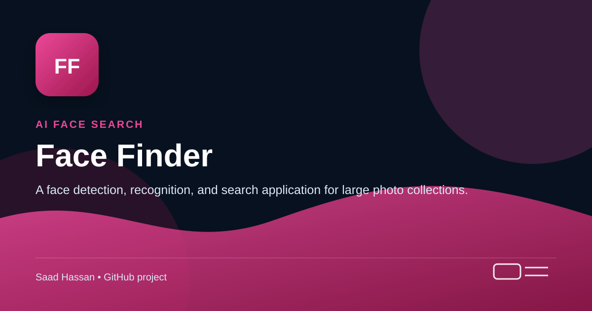

<!-- Project cover -->
<p align="center">
  
</p>

> **AI face search** — A face detection, recognition, and search application for large photo collections.

## Project snapshot

- Index local or Google Drive photos, search by selfie, verify faces, and manage albums.
- Includes a root-level <a href="./project-cover.svg">project-cover.svg</a>, a scalable project cover graphic for this repository.

---

# Face Finder

A powerful face detection, recognition, and search application that helps you find yourself (or anyone) in large photo collections. Built with state-of-the-art AI models and a modern web interface.

## 🎯 What It Does

- **Index Photo Collections**: Process folders of images to detect and index all faces
- **Google Drive Integration**: Connect to your Google Drive and index photos directly from the cloud
- **Find People in Photos**: Upload a selfie and find all photos containing that person
- **Face Verification**: Compare two photos to check if they're the same person
- **Album Management**: Save indexed galleries as albums to switch between events/collections
- **Real-time Progress**: Live progress tracking for all long-running operations

## ✨ Features

| Feature | Description |
|---------|-------------|
| 🔍 **Face Detection** | SCRFD model - fast and accurate face detection with keypoint alignment |
| 🧠 **Face Recognition** | LVFace (ICCV 2025) - state-of-the-art face embeddings |
| 🗄️ **Vector Search** | Qdrant - efficient similarity search across millions of faces |
| ⚡ **GPU Acceleration** | CUDA/DirectML support for fast inference on GPUs |
| 💾 **Album System** | Save/load indexed galleries without reprocessing |
| ☁️ **Google Drive** | Index photos directly from your Google Drive |
| 🌐 **Modern UI** | React + TypeScript frontend with real-time progress bars |

## 🏗️ Architecture

```
┌─────────────────────────────────────────────────────────────────────────────┐
│                              FRONTEND (React + Vite)                         │
│  ┌──────────┐  ┌──────────┐  ┌──────────┐  ┌──────────┐  ┌──────────┐       │
│  │  Upload  │  │  Search  │  │  Verify  │  │  Albums  │  │ Settings │       │
│  │   Page   │  │   Page   │  │   Page   │  │   Page   │  │   Page   │       │
│  └────┬─────┘  └────┬─────┘  └────┬─────┘  └────┬─────┘  └────┬─────┘       │
│       └─────────────┴─────────────┴─────────────┴─────────────┘             │
│                                    │                                         │
│                              REST API / SSE                                  │
└────────────────────────────────────┼─────────────────────────────────────────┘
                                     │
┌────────────────────────────────────┼─────────────────────────────────────────┐
│                          BACKEND (FastAPI)                                   │
│                                    │                                         │
│  ┌─────────────────────────────────┴─────────────────────────────────────┐  │
│  │                           API Endpoints                                │  │
│  │  • /gallery/index-folder (SSE)  • /gallery/find-person               │  │
│  │  • /gallery/save/stream (SSE)   • /gallery/load/{name}/stream (SSE)  │  │
│  │  • /detect  • /verify  • /health  • /stats                           │  │
│  └───────┬──────────────────────┬──────────────────────┬─────────────────┘  │
│          │                      │                      │                     │
│  ┌───────▼───────┐    ┌────────▼────────┐    ┌────────▼────────┐           │
│  │     SCRFD     │    │     LVFace      │    │  Qdrant Service │           │
│  │  (Detection)  │    │  (Embeddings)   │    │ (Vector Search) │           │
│  │               │    │                 │    │                 │           │
│  │  • 10G model  │    │  • 512-dim      │    │  • CRUD ops     │           │
│  │  • Keypoints  │    │  • ViT arch     │    │  • Similarity   │           │
│  │  • Alignment  │    │  • GPU accel    │    │  • Filtering    │           │
│  └───────────────┘    └─────────────────┘    └────────┬────────┘           │
│                                                        │                     │
└────────────────────────────────────────────────────────┼─────────────────────┘
                                                         │
                              ┌───────────────────────────┴───────────────────┐
                              │              Qdrant Vector Database            │
                              │                                                │
                              │  Collections:                                  │
                              │  • face_embeddings (main gallery)             │
                              │  • saved_gallery_* (saved albums)             │
                              │                                                │
                              │  Indexes: type, person_id, image_id           │
                              └────────────────────────────────────────────────┘
```

## 🔄 How It Works

### 1. Indexing Images

```
┌──────────┐    ┌──────────────┐    ┌──────────────┐    ┌─────────────┐
│  Image   │───▶│ Face Detect  │───▶│   Align &    │───▶│  Generate   │
│  File    │    │   (SCRFD)    │    │    Crop      │    │  Embedding  │
└──────────┘    └──────────────┘    └──────────────┘    └──────┬──────┘
                      │                                        │
                      ▼                                        ▼
               ┌──────────────┐                         ┌─────────────┐
               │  Bounding    │                         │  512-dim    │
               │  Boxes +     │                         │  Vector     │
               │  Keypoints   │                         │  (LVFace)   │
               └──────────────┘                         └──────┬──────┘
                                                               │
                                                               ▼
                                                        ┌─────────────┐
                                                        │   Store in  │
                                                        │   Qdrant    │
                                                        └─────────────┘
```

### 2. Finding a Person

```
┌──────────┐    ┌──────────────┐    ┌──────────────┐    ┌─────────────┐
│  Query   │───▶│ Face Detect  │───▶│  Generate    │───▶│  Similarity │
│  Photo   │    │  & Align     │    │  Embedding   │    │   Search    │
└──────────┘    └──────────────┘    └──────────────┘    └──────┬──────┘
                                                               │
                                                               ▼
                                                        ┌─────────────┐
                                                        │  Top-K      │
                                                        │  Matches    │
                                                        │  (Images)   │
                                                        └─────────────┘
```

### 3. Album System

```
┌─────────────────┐         ┌─────────────────┐
│  Main Gallery   │◀───────▶│  Saved Albums   │
│                 │  Save/  │                 │
│  face_embeddings│  Load   │  saved_gallery_ │
│  collection     │         │  * collections  │
└─────────────────┘         └─────────────────┘
```

- **Save**: Copies all gallery entries to a named collection
- **Load**: Clears main gallery, restores from saved collection
- **Switch**: Easily switch between Wedding, Birthday, Conference, etc.

### 4. Google Drive Integration

```
┌──────────────┐    ┌──────────────┐    ┌──────────────┐    ┌─────────────┐
│   Google     │───▶│   Download   │───▶│   Process    │───▶│   Store     │
│   Drive      │    │   to RAM     │    │   Face &     │    │  Embedding  │
│   OAuth 2.0  │    │   (stream)   │    │   Embed      │    │  in Qdrant  │
└──────────────┘    └──────────────┘    └──────────────┘    └─────────────┘
                           │
                           ▼
                    ┌──────────────┐
                    │  🔒 Privacy  │
                    │  Images are  │
                    │  NEVER saved │
                    │  to disk     │
                    └──────────────┘
```

- **OAuth 2.0**: Secure authentication with Google
- **Read-only Access**: Only reads your photos, never modifies them
- **Memory Processing**: Images downloaded to RAM, processed, then discarded
- **Privacy First**: Only face embeddings (512 numbers) are stored, not images

## 🚀 Quick Start

### Prerequisites

- Python 3.9+
- Node.js 18+ (for frontend)
- NVIDIA GPU with CUDA 11.8/12.x (optional, for GPU acceleration)
- Qdrant server (local Docker or Qdrant Cloud)

### 1. Clone & Setup Python Environment

```powershell
# Create virtual environment
python -m venv faceFinder
faceFinder\Scripts\activate

# Install dependencies
pip install -r requirements.txt
```

### 2. Download AI Models

You need to **download** the required models and place them in the `models/` directory.

---

#### Download SCRFD (Face Detector)

- Download SCRFD from:  
  https://github.com/cospectrum/scrfd/tree/main/models

- Place the downloaded file in models directory

- Download LVFace from:  
https://huggingface.co/bytedance-research/LVFace/tree/main
- Rename the downloaded file to *lvface*:
- Place it in models/ directory

### 3. Setup Qdrant Database

**Option A: Local Docker**
```powershell
docker run -p 6333:6333 -p 6334:6334 qdrant/qdrant
```

**Option B: Qdrant Cloud** (Recommended for production)
1. Create account at [cloud.qdrant.io](https://cloud.qdrant.io)
2. Create a cluster and get your URL + API key

### 4. Configure Environment

```powershell
# Copy example config
cp .env.example .env
```

Edit `.env` with your settings:
```env
# Qdrant Cloud (recommended)
QDRANT_URL=https://your-cluster.cloud.qdrant.io:6333
QDRANT_API_KEY=your-api-key

# Or Local Qdrant
QDRANT_HOST=localhost
QDRANT_PORT=6333

# GPU Settings
USE_GPU=true
```

### 5. Setup Google Drive (Optional)

To enable Google Drive integration:

1. Go to [Google Cloud Console](https://console.cloud.google.com/)
2. Create a new project or select existing one
3. Enable the **Google Drive API**
4. Go to **Credentials** → **Create Credentials** → **OAuth 2.0 Client ID**
5. Select **Desktop app** as application type
6. Download the JSON file and save as `credentials.json` in project root

```
Face-Finder/
├── credentials.json    ← Place here
├── main.py
└── ...
```

> **Note**: The app uses read-only access (`drive.readonly` scope). Your photos are never stored - only processed in memory.

### 6. Start Backend

```powershell
# Activate environment first
.\faceFinder\Scripts\Activate.ps1

# Start FastAPI server
python main.py
```

Backend runs at: http://localhost:8000

### 7. Start Frontend

```powershell
# In a new terminal
cd frontEnd

# Install dependencies (first time only)
npm install

# Start development server
npm run dev
```

Frontend runs at: http://localhost:5173

## 📱 Using the Application

### Upload Page
1. **Upload Files**: Drag & drop images or click to select
2. **Index Folder**: Enter a local folder path containing your photos
3. **Google Drive**: Connect to your Drive and browse folders
   - Click "Connect to Google Drive"
   - Authorize read-only access
   - Browse and select a folder
   - Click "Index Drive Folder"
4. Watch the progress bar as faces are detected and indexed
5. See stats: total images processed, faces found, processing time

### Search Page
1. Upload a photo of the person you want to find
2. Adjust similarity threshold (default 0.6)
3. Click "Find Person"
4. Browse through all matching photos with similarity scores

### Albums Page
1. **Save Current Gallery**: Give it a name (e.g., "Wedding 2024")
2. **Load Album**: Restore a previously saved album
3. **Clear Gallery**: Remove current indexed faces (albums are preserved)

### Verify Page
1. Upload two photos
2. See if they're the same person with confidence score

### Settings Page
1. View system health status
2. Check component connectivity (Qdrant, models)
3. Access API documentation
4. Clear all data (danger zone)

## 🔌 API Reference

### Gallery Operations

| Endpoint | Method | Description |
|----------|--------|-------------|
| `/gallery/index` | POST | Index a single image |
| `/gallery/index-bulk` | POST | Index multiple images |
| `/gallery/index-folder` | POST | Index folder with progress (SSE) |
| `/gallery/find-person` | POST | Find person in indexed gallery |
| `/gallery/stats` | GET | Get gallery statistics |
| `/gallery/clear` | DELETE | Clear current gallery |

### Album Operations

| Endpoint | Method | Description |
|----------|--------|-------------|
| `/gallery/save/stream` | POST | Save gallery with progress (SSE) |
| `/gallery/load/{name}/stream` | POST | Load album with progress (SSE) |
| `/gallery/saved` | GET | List all saved albums |
| `/gallery/saved/{name}` | DELETE | Delete a saved album |

### Google Drive Operations

| Endpoint | Method | Description |
|----------|--------|-------------|
| `/drive/status` | GET | Check Drive connection status |
| `/drive/auth/url` | GET | Get OAuth authorization URL |
| `/drive/auth/callback` | GET | Handle OAuth callback |
| `/drive/logout` | POST | Disconnect from Google Drive |
| `/drive/folders` | GET | List Drive folders |
| `/drive/contents/{id}` | GET | List folder contents |
| `/drive/index/{id}` | POST | Index Drive folder (SSE) |
| `/drive/thumbnail/{id}` | GET | Get file thumbnail |

### Face Operations

| Endpoint | Method | Description |
|----------|--------|-------------|
| `/detect` | POST | Detect faces in image |
| `/verify` | POST | Compare two faces |
| `/embed` | POST | Get face embeddings |

### System

| Endpoint | Method | Description |
|----------|--------|-------------|
| `/health` | GET | Health check |
| `/stats` | GET | Database statistics |
| `/docs` | GET | Swagger API docs |

## ⚙️ Configuration

| Variable | Default | Description |
|----------|---------|-------------|
| `API_HOST` | `0.0.0.0` | API server host |
| `API_PORT` | `8000` | API server port |
| `SCRFD_MODEL_PATH` | `models/scrfd.onnx` | SCRFD model path |
| `DETECTION_THRESHOLD` | `0.5` | Face detection confidence |
| `LVFACE_MODEL_PATH` | `models/lvface.onnx` | LVFace model path |
| `USE_GPU` | `true` | Enable GPU acceleration |
| `EMBEDDING_DIM` | `512` | Face embedding dimension |
| `QDRANT_HOST` | `localhost` | Qdrant host (local) |
| `QDRANT_PORT` | `6333` | Qdrant port (local) |
| `QDRANT_URL` | - | Qdrant Cloud URL |
| `QDRANT_API_KEY` | - | Qdrant API key |
| `QDRANT_COLLECTION_NAME` | `face_embeddings` | Main collection name |
| `SIMILARITY_THRESHOLD` | `0.6` | Match threshold (0-1) |

## 📁 Project Structure

```
Face-Finder/
├── main.py                    # FastAPI application & endpoints
├── config.py                  # Configuration (Pydantic settings)
├── models.py                  # Data models (request/response)
├── requirements.txt           # Python dependencies
├── download_models.py         # Model download utility
├── .env                       # Environment configuration
│
├── services/
│   ├── face_detection.py      # SCRFD face detection
│   ├── face_embedding.py      # LVFace embeddings (GPU/CPU)
│   ├── qdrant_service.py      # Vector DB operations & albums
│   └── google_drive.py        # Google Drive OAuth & file access
│
├── frontEnd/
│   ├── src/
│   │   ├── App.tsx            # Main app with routing
│   │   ├── pages/
│   │   │   ├── UploadPage.tsx # Folder/Drive indexing with progress
│   │   │   ├── SearchPage.tsx # Find person in photos
│   │   │   ├── AlbumsPage.tsx # Save/load gallery albums
│   │   │   ├── VerifyPage.tsx # Face verification
│   │   │   ├── DriveCallbackPage.tsx # OAuth callback handler
│   │   │   └── SettingsPage.tsx # System health & config
│   │   ├── components/
│   │   │   ├── Navbar.tsx     # Navigation sidebar
│   │   │   ├── ResultsGrid.tsx # Photo results display
│   │   │   ├── DriveFolderBrowser.tsx # Drive folder browser modal
│   │   │   └── LoadingSpinner.tsx
│   │   └── services/
│   │       └── api.ts         # API client with SSE support
│   ├── package.json
│   └── vite.config.ts         # Vite config with API proxy
│
├── models/                    # AI model files (auto-downloaded)
│   ├── scrfd.onnx
│   └── lvface.onnx
│
├── credentials.json           # Google OAuth credentials (you provide)
│
└── faceFinder/                # Python virtual environment
```

## 🖥️ GPU Support

The application supports GPU acceleration for faster embedding generation.

### NVIDIA CUDA
```powershell
# Requires CUDA 11.8 or 12.x
pip install onnxruntime-gpu

# Verify CUDA is available
python -c "import onnxruntime; print(onnxruntime.get_available_providers())"
# Should show: ['CUDAExecutionProvider', 'CPUExecutionProvider']
```

### AMD/Intel (DirectML)
```powershell
pip install onnxruntime-directml

# Works with DirectX 12 compatible GPUs
```

The application automatically selects the best available provider:
1. CUDAExecutionProvider (NVIDIA)
2. DmlExecutionProvider (DirectML)
3. CPUExecutionProvider (fallback)

## 🔧 Troubleshooting

### "Qdrant connection failed"
- Ensure Qdrant is running: `docker ps`
- Check QDRANT_URL/QDRANT_HOST settings
- Verify API key for Qdrant Cloud

### "No faces detected"
- Ensure good lighting in photos
- Try lowering `DETECTION_THRESHOLD` (default 0.5)
- Check image isn't corrupted

### "GPU not being used"
- Verify CUDA installation: `nvidia-smi`
- Check onnxruntime-gpu is installed
- Set `USE_GPU=true` in .env

### "Frontend can't connect to backend"
- Backend must be running on port 8000
- Check vite.config.ts proxy settings
- Ensure no CORS issues (should be configured)

### "Google Drive connection failed"
- Ensure `credentials.json` exists in project root
- Check that Google Drive API is enabled in Cloud Console
- Verify OAuth consent screen is configured
- Try disconnecting and reconnecting

### "Drive indexing slow"
- Images are downloaded one at a time to preserve memory
- Large folders will take time (progress shown in real-time)
- Consider using local folders for very large collections

## 🙏 Acknowledgments

- [SCRFD](https://github.com/cospectrum/scrfd) - State-of-the-art face detection
- [LVFace](https://github.com/bytedance/LVFace) - SOTA Face recognition (ByteDance)
- [Qdrant](https://qdrant.tech/) - High-performance vector database
- [FastAPI](https://fastapi.tiangolo.com/) - Modern Python web framework
- [React](https://react.dev/) + [Vite](https://vitejs.dev/) - Frontend framework
